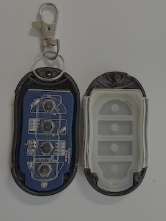
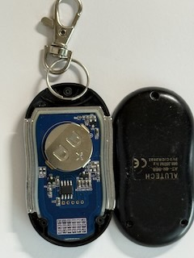
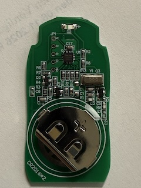

# ALUTECH AT-4N-868

Reverse engineering a garage door remote key fob.

## Hypothesis

* Can this radio protocol be decoded in rtl_433, and are there any vulnerabilities?
* Create a flex decoder `alutech.conf` file based on examples from [rtl_433 conf](https://github.com/merbanan/rtl_433/tree/master/conf).
* Create a C version and possibly merge it into [rtl_433 devices](https://github.com/merbanan/rtl_433/tree/master/src/devices).
* Is it possible to open the garage door with a Flipper? -> Flipper can **decode/read** the frame (it has a built-in `alutech_at_4n` protocol), but the rolling code cannot be cloned/replayed without the manufacturer rainbow table, so it cannot open the door.
* **This is *not* a Microchip HCS301 / KeeLoq.** The chip has no markings, but the protocol is a proprietary "Alutech AT-4N" scheme.
  * A new unit bought from Aliexpress has U1 = Arm Cortex-M0+ (PUYA PY32F002A), i.e. it runs custom firmware — consistent with a bespoke (non-KeeLoq) rolling code.
  * Confirmed by [Flipper's `alutech_at_4n.c`](https://github.com/flipperdevices/flipperzero-firmware/blob/dev/lib/subghz/protocols/alutech_at_4n.c) decoder, which targets exactly this fob (72-bit frame, CRC-8 poly `0x31`, custom obfuscation + rainbow table — nothing like KeeLoq).

  
## Steps
[ ] Decode Sampling rates with [I/Q Spectrogram & Pulsedata](https://triq.org/pdv3/)
[ ] Add samples to tests/Microchip merge [rtl_433 tests](https://github.com/merbanan/rtl_433_tests)
[ ] Create a C version and possibly merge it into [rtl_433 devices](https://github.com/merbanan/rtl_433/tree/master/src/devices)

## Datasheets

| No  | Description    | IC                                                                                                                            |
| --- | ---            | ---                                                                                                                           |
| U1  | Arm Cortex-M0+ (runs the custom Alutech firmware) | [PUYA F002AW15 SH6HN1B](https://www.puyasemi.com/download_path/%E6%95%B0%E6%8D%AE%E6%89%8B%E5%86%8C/MCU%20%E5%BE%AE%E5%A4%84%E7%90%86%E5%99%A8/PY32F002A_Datasheet_V0.2.pdf)|

> ~~Microchip HCS301~~ — earlier assumption, now ruled out. The protocol is not KeeLoq (see below).

## Reverse engineering

Universal Radio Hacker (URH) recorded and tried to decode the data from one [keypress](urh_alutech.complex16s).

* It is 868.35 MHz ASK (a.k.a. OOK in URH).
* It uses a rolling code, so a simple clone is not enough.
* There is a preamble of 6 `a` in hex, and the message is repeated 3 times per keypress.
* A pause threshold of 10 under modulation is enough to capture the preamble and message in a single message.
* ~~Converting from URH to an RTL flex decoder using this as~~ [inspiration](https://github.com/klohner/klohner.github.io/blob/master/SDR/Decoding/Example_2019-01-24/README.md).

After looking at the datasheet and the recorded data:

* There is a ~9350 µs window with 12 one-bits (~389 µs each).
* Followed by a ~4150 µs break.
* A `1` is encoded as a ~370 µs short signal (1x).
* A `0` is encoded as a ~760 µs long signal (2x).
* The full symbol period is ~1123 µs (3x).
* The [HCS200](https://github.com/merbanan/rtl_433/blob/master/src/devices/hcs200.c) KeeLoq decoder fails here — not a bug: a KeeLoq frame is 66 bits, but this protocol is **72 bits**. It was never an HCS device.
* The new Arm Cortex-M0+ unit repeats the message 6 times instead of 3.

## Protocol match (Flipper Zero)

The frame matches Flipper's [`alutech_at_4n`](https://github.com/flipperdevices/flipperzero-firmware/blob/dev/lib/subghz/protocols/alutech_at_4n.c) decoder:

| Parameter | Capture | Flipper `alutech_at_4n` |
| --- | --- | --- |
| Bits | 72 | `min_count_bit_for_found = 72` |
| Modulation | OOK/ASK | OOK |
| Short / long | ~320–370 / ~740–760 µs | `te_short = 400` / `te_long = 800` (±140) |

Decoded frame layout (after decryption), per the Flipper source:

* `serial` — 32-bit (bits 24–55)
* `cnt` (rolling counter) — 16-bit (bits 8–23)
* `btn` — 8-bit (bits 0–7): `0xFF`=1, `0x11`=2, `0x22`=3, `0x33`=4, `0x44`=5
* `crc` — 8-bit (bits 56–63), CRC-8 poly `0x31` over the payload byte

> Note: the offsets above are for the **decrypted** frame. The raw on-air bits go through a custom `magic_data` obfuscation + rainbow table, so a flex decoder only sees the encrypted form.

## Images

